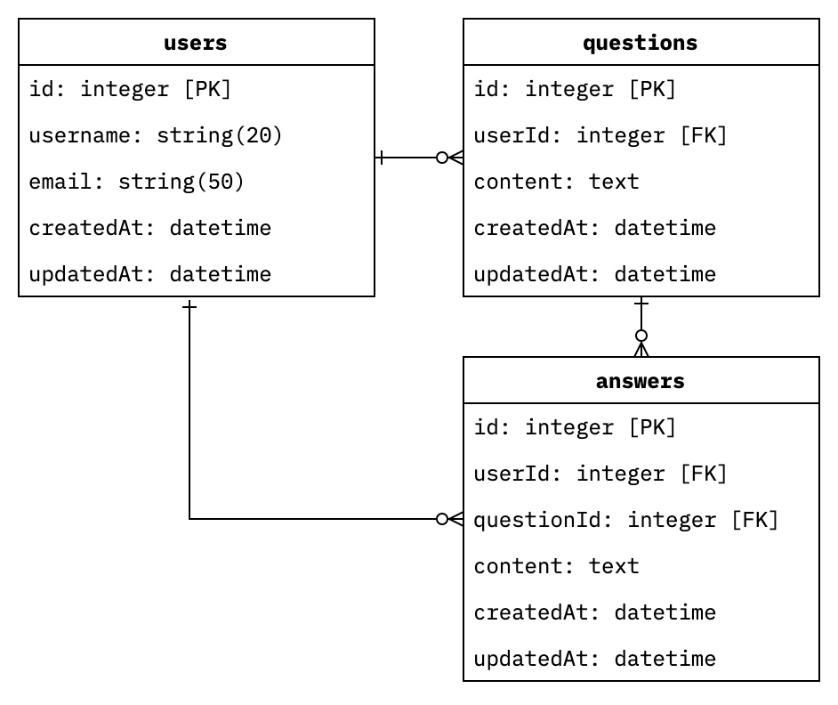

# ex04 - QnA

|                         |                                                                                                        |
| :---------------------- | ------------------------------------------------------------------------------------------------------ |
| 제출할 폴더 이름 :      | ex04                                                                                                   |
| 제출할 파일 이름 :      | 프로젝트에 필요한 모든 파일                                                                            |
| 사용 가능한 외부 모듈 : | nodemon, express, morgan, dotenv, sequelize, sequelize-cli, mysql2 혹은 mariadb, typescript(선택 사항) |
| 참고사항 :              | 없음                                                                                                   |

이제 질문, 답변을 위한 테이블을 만든 다음 테이블 간의 관계를 설정할 시간입니다.

질문과 답변 테이블의 `content`에는 이모지까지 입력될 수 있어야합니다.

관계 설정은 `associate` 메서드를 사용하세요. SQL을 직접 사용해서는 안 됩니다.

아래 다이어그램을 참고해서 `questions`과 `answers` 테이블을 생성하세요.



각 테이블의 외래키는 `associate` 메서드에 의해 자동으로 설정되어야 합니다.

테이블이 설정되었다면 질문과 답변을 추가할 수 있게 API를 구축하세요.

## API 명세

### 질문 추가하기

#### Requests

- URL: `http://localhost:4242/questions`
- Method: `POST`
- Parameters: None
- Query: None
- Body: `JSON` 형식

  ```json
  {
    "userId": 42,
    "content": "This is a question."
  }
  ```

#### Responses

- Content: `JSON` 형식

  ```json
  {
    "message": "Question added successfully.",
    "data": {
      "id": 1,
      "userId": 42,
      "content": "Hi. This is a question."
    }
  }
  ```

### 답변 추가하기

#### Requests

- URL: `http://localhost:4242/answers`
- Method: `POST`
- Parameters: None
- Query: None
- Body: `JSON` 형식

  ```json
  {
    "userId": 84,
    "questionId": 1,
    "content": "Here is a answer."
  }
  ```

#### Responses

- Content: `JSON` 형식

  ```json
  {
    "message": "Answer added successfully.",
    "data": {
      "id": 3,
      "userId": 84,
      "questionId": 1,
      "content": "Here is a answer."
    }
  }
  ```
