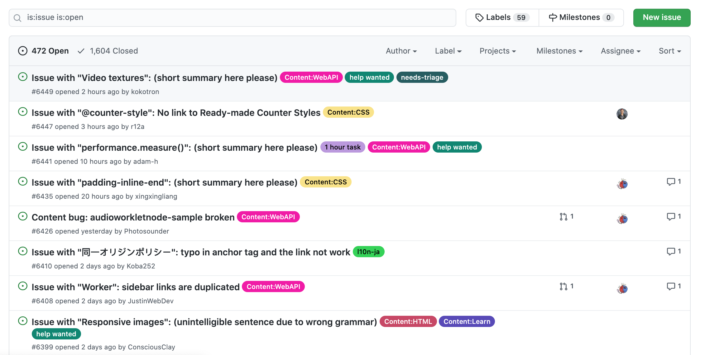

# FE 03 - 나만의 Issue Tracker

|                      |                    |
| --------------------:| ------------------ |
|   제출할 폴더 이름 :     |  fe03              |
|   제출할 파일 이름 :     |  제한 없음           |
|   사용 가능한 외부 모듈 : |  제한 없음           |
|   참고사항 :           |  없음               |

 

<h2 align="middle">나만의 Issue Tracker</h2>

React와 Github v3 API로 나만의 Issue Tracker를 만들어보아요.

> 라이브러리/프레임워크에는 제한이 없고 자유롭다. 하지만, 라이브러리/프레임워크를 사용하는 이유는 상대방을 설득할 수 있어야 한다.

## 기능 구현

- 준수한 UI/UX를 구성해야한다.
- 특정 저장소를 검색할 수 있다.
- 검색된 저장소의 이슈를 목록으로 나타낼 수 있다.
- 이슈를 생성/편집/삭제할 수 있다.
- 이슈 기능
  - 담당자를 지정/삭제할 수 있다.
  - 댓글을 생성/편집/수정할 수 있다.
  - 라벨을 생성/편집/삭제할 수 있다.
  - 댓글을 잠금/해제할 수 있다.
  - 이슈를 닫거나 열 수 있다.
- 이슈, 라벨 무한 스크롤링으로 목록을 나타낼 수 있다.
  - `쓰로틀링(throttling)`, `디바운싱(debouncing)`을 참고한다.
- 이슈를 상단에 pin할 수 있다.
  - pin 이슈들은 `drag and drop`을 통해 카드 순서를 바꿀 수 있다.
- 모든 동작은 새로고침 없이 페이지에 바로 반영돼야 한다.
- Github v3 API을 이용해서 해당 페이지에서 적용된 내용이 실제 Github에서 적용되게 한다.
- Github v3 API에 대한 Error Handling을 해야한다.

> `presentation container pattern`과 같은 디자인 패턴을 찾아보세요.

## 보너스

- 무한 스크롤링에 `쓰로틀링(throttling)`과 `디바운싱(debouncing)`중 하나를 선택해서 적용한다.
- 마일스톤을 생성/편집/삭제할 수 있습니다.
  - 마일스톤은 무한 스크롤링으로 목록을 나타낼 수 있다.
- 검색된 검색어는 3개까지 저장할 수 있다.
  - 검색어는 브라우저를 종료해도 유지되어야한다.
- 모든 빈 페이지에 대해 대체 이미지가 있다.
- 다크 모드를 지원한다.
  - 다크모드는 input을 통해 지원되어야한다. 
  - input의 type은 checkbox 이다.
- CSS 전처리기를 이용해 구현한다.
  
> https://docs.github.com/en/rest
