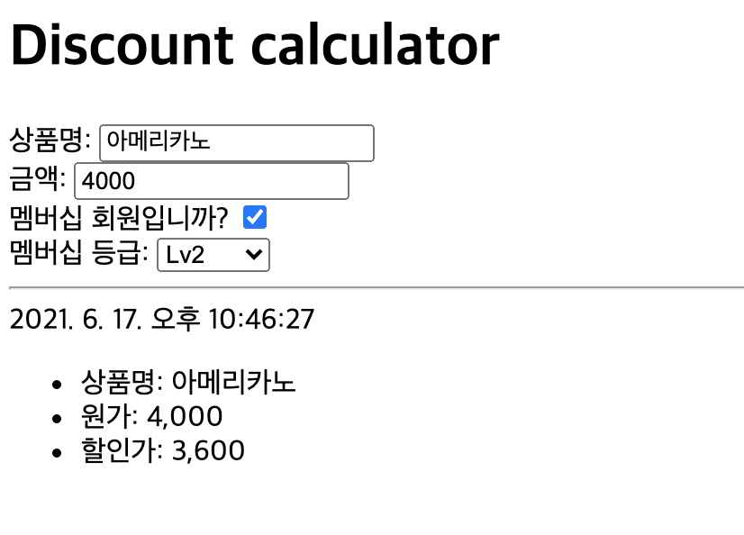

# ex 02 - Discount calculator

|                      |                      |
| --------------------:| -------------------- |
|   제출할 폴더 이름 :     |  ex00                |
|   제출할 파일 이름 :     |  index.html, calc.js |
|   사용 가능한 외부 모듈 : |  없음                 |
|   참고사항 :           |  없음                 |

상품 정보를 입력하면 멤버십 상태에 따라 할인율을 계산하는 페이지를 만드세요. HTML 파일과 JS 파일을 제출해야 합니다. External Javascript를 사용하세요.

페이지 `title`과 `h1`은 `Discount calculator`입니다.

Form에 포함될 요소는 아래와 같습니다.

- `상품명`: 텍스트 필드
- `금액`: 숫자 필드
- `멤버십 회원입니까?`: checkbox field를 사용해야 합니다. 체크할 경우 바로 아래에서 `멤버십 등급`을 선택할 수 있습니다.
- 멤버십 등급: select 요소. `멤버십 회원입니까?` 가 체크되지 않았다면 `disabled` 됩니다. option을 선택할 수 있어야 합니다. 레벨은 3단계이며, 할인율은 각 option 요소의 `data-percent` 속성의 값으로 들어갑니다.
    - `--선택--`: 옵션을 선택하기 전 기본값
    - `Lv1`: 5% 할인
    - `Lv2`: 10% 할인
    - `Lv3`: 15% 할인

Form의 HTML 요소는 시맨틱에 맞게 작성되어야 합니다. 제출 버튼은 필요 없습니다.

Form 아래에는 `hr` 요소가 들어갑니다.

Form 아래에는 영수증처럼 내용이 표시됩니다. 내용은 Form이 수정될 때마다 실시간으로 업데이트됩니다. 

- 시각: HTML `time` 요소. 내용은 로컬 표기법에 따라 표시되고 `datatime` 속성에는 ISO 형식으로 표시됩니다.
- `상품명`: 입력한 상품명
- `원가`: 할인이 적용되지 않은 입력한 금액. 단위마다 `,` 를 표시합니다.
- `할인가`: `원가`에 선택한 멤버십 등급에 따라 할인율이 적용된 최종 금액을 표시합니다. 천 단위마다 `,` 를 표시합니다.

Form과 영수증의 스타일을 마음껏 꾸며보세요! 단, Internal Style Sheet만 허용됩니다.

Figure 2.1: 완성된 결과물의 스크린샷. 지역 설정에 따라 시간 형식은 다를 수 있습니다.
