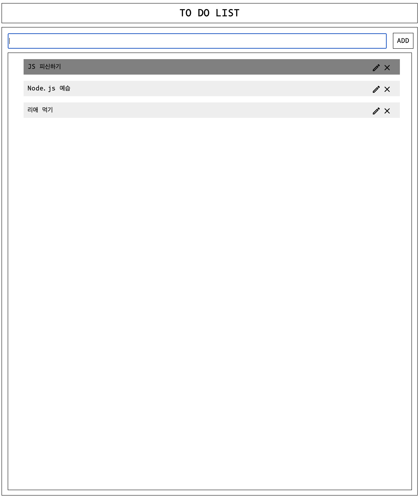

## ex05 - ToDoList

생성, 체크, 업데이트, 제거 기능을 가진 ToDoList를 HTML, CSS, JS을 사용하여 구현하세요.

Internal Style Sheet를 허용하지 않습니다.

제출할 폴더 이름: `ex05/`

제출할 파일 이름: `ex05.html`, `ex05.css`, `ex05.js`

- 예시는 예시일 뿐입니다. 자유롭게 커스터마이징하세요.
- CR(U)D 기능은 필수입니다.
- ToDo에 마우스가 올라갔을 때, 사용자가 알 수 있도록 하세요.
- ToDo를 클릭 했을 때, 어떤 방식이로든 체크되도록 하세요.
- ToDo를 삭제할 수 있는 기능을 구현하세요.
- Update 기능은 선택입니다. 구현한다면 보너스를 받을수도?
