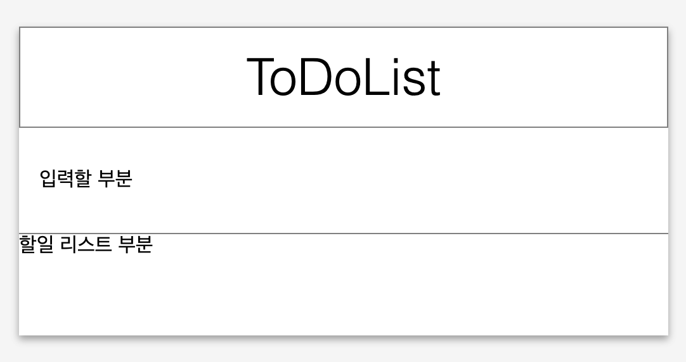

# 예제 00 - 안녕 리액트!

|                      |                    |
| --------------------:| ------------------ |
|   제출할 폴더 이름 :     |  ex00              |
|   제출할 파일 이름 :     |public/index.html,src/App.js, src/index.js|
|   사용 가능한 외부 모듈 : |                    |
|   참고사항 :           |                    |

create-react-app(CRA)을 설치하고, 디폴트로 설정되어있는 Welcome to React 페이지를 띄워보세요.

App.js 내부 function App()에 jsx를 사용하여 ToDoList 템플릿을 만들고 리턴하여 ToDoList 템플릿 페이지를 띄워보세요.

이 과정은 ToDoList의 틀을 만드는 과정으로 기능은 작동하지 않아도 됩니다.

ToDoList 템플릿은 유저가 ToDo를 입력할 섹션과, 입력한 ToDo가 리스트로 나타날 섹션이 필수로 있어야 합니다.

